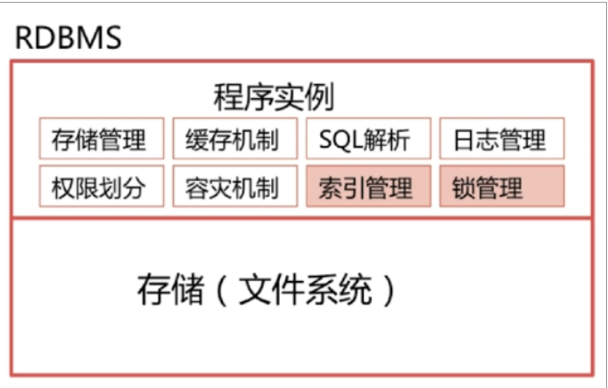

# MySQL

## 事务

事务是应用程序中一系列严密的操作，所有操作必须成功完成，否则在每个操作中所作的所有更改都会被撤消。也就是事务具有原子性，一个事务中的一系列的操作要么全部成功，要么一个都不做。

## 事务四大特性

- 原子性：事务要么全部执行，要么全部不执行，是不可分割的工作单位。

- 一致性：指事务开始之前和结束以后，完整性约束没有被破坏。

- 隔离性：多个事务并发访问时，事务之间是隔离的，一个事务不应该影响其它事务运行效果。

- 持久性：意味着事务在完成之后，该事务对数据库所作的更改便持久的保存在数据库中，并不会被回滚。


## 事务的并发、隔离级别

### 并发

理论上来说，事务应该彼此完全隔离，以避免并发事务所导致的问题，然而会对性能产生极大的影响，因为事务必须按顺序运行，**在实际开发中，为了提升性能，事务会以较低的隔离级别运行，事务的隔离级别可以通过隔离事务属性指定。**

### 事务的并发问题

1. 脏读：事务A读取了事务B更新的数据，然后B回滚操作，那么A读取到的数据是脏数据。

2. 丢失修改：指在一个事务读取一个数据时，另外一个事务也访问了该数据，那么在第一个事务中修改了这个数据后，第二个事务也修改了这个数据。这样第一个事务修改的结果就会丢失，因此称为丢失修改。

3. 不可重复读：事务A多次读取同一数据，事务B在事务A多次读取的过程中，对数据作了更新并提交，导致事务A多次读取同一数据时，出现的结果不一致。

4. 幻读：解决了不重复读，保证了同一个事务里，查询的结果都是事务开始时的状态。比如说，当A事务将表中c字段的值都改为3，而B事务新增一条数据，c字段为2，那么此时再查看数据会发现有一条并没有修改，这就是幻读。

   

### 事务隔离级别

1. 读未提交：即能够读取到没有被提交的数据。

2. 读已提交：能够读到已提交的数据。

3. 重复读取：即在数据读出来之后加锁，防止别人修改。MySQL默认隔离级别。

4. 串行化：最高的事务隔离级别，不管多少事务，挨个运行完一个事务的所有子事务之后才可以Y行另外一个事务里面的所有子事务。

5. | 事务隔离级别 | 脏读 | 不可重复读 | 幻读 |
   | ------------ | ---- | ---------- | ---- |
   | 读未提交     | Y    | Y          | Y    |
   | 读已提交     | N    | Y          | Y    |
   | 可重复读     | N    | N          | Y    |
   | 串行化       | N    | N          | N    |


## 索引

###  优点

- 加快数据的检索速度，最主要原因
- 在使用分组和排序子句进行数据检索时，同样可以显著减少查询中分组和排序的时间
- 通过使用索引，可以在查询中使用优化隐藏器，提高系统的性能

###  缺点

- 创建索引和维护索引要耗费时间，随着数据量的增加而增加
- 会占用物理空间，除了数据表占用数据空间之外，每个索引还要占一定的物理空间
- 数据的增、删、改会慢，需要维护索引

###  普通索引

####  创建方式

- create index  [indexname] on table(字段)
- alter table add index [indexname] on (字段)

###  唯一索引

索引列的值必须唯一，但允许有控制；如果是组合索引，那么组合必须唯一

####  创建方式

- create unique index [indexname] on table(字段)
- alter table add unique [indexname] on (字段)
- create table mytable(id int not null,unique[indexname] (id))

###  主键索引

是一种特殊的唯一索引，不允许有空值，在建表的时候同时创建主键索引，一个表只能有一个主键。

### 复合索引

可以只使用复合索引中的一部分，但必须是由最左部分开始，且可以存在常量。

## 一个表能建多少个索引

mysql 版本不同单表支持索引数也不同，64位系统，版本5.0后，mysql 可支持16个索引，最大索引长度256字节。

对于大数据体量，创建索引会大大提升查询性能，因为建立索引的时间开销是O(1)或者O(logN)。

### MySQL数据库联合索引的命中规则

- MySQL联合索引遵循最左前缀匹配规则，即从联合索引的最左列开始向右匹配，直到遇到匹配终止条件。例如联合索引(col1, col2, col3), where条件为col1=`a` AND col2=`b`可命中该联合索引的(col1,col2)前缀部分, where条件为col2=`b` AND col3=`c`不符合最左前缀匹配，不能命中该联合索引。
- 匹配终止条件为范围操作符(如>, <, between, like等)或函数等不能应用索引的情况。例如联合索引(col1, col2, col3), where条件为col1=`a` AND col2>1 AND col3=`c`, 在col2列上为范围查询，匹配即终止，只会匹配到col1，不能匹配到(col1, col2, col3).
- where条件中的顺序不影响索引命中。例如联合索引(col1, col2, col3), where条件为col3=`c` AND col2=b AND col1=`a`, MySQL优化器会自行进行优化，可命中联合索引(col1, col2, col3).

## 存储引擎

MySQL中的数据用各种不同的技术存储在文件（内存）中。

###  MyISAM

- 默认存储引擎，不支持事务、外键，速度快，用于无事务要求或者select、insert为主的场景
- 会创建3个文件 .frm(表定义)、.MYD(MYData，存储数据)，.MYI(MYIndex，存储索引)，默认为非聚集索引
- 支持三种存储格式：静态表、动态表、压缩表
  1. 静态表：默认格式，占空间大，记录长度不够时会用空格填充，主要为固定长度类型。
  2. 动态表：包含变长字段(varchar,text,blob)，占空间少，但是频繁更新和删除会产生碎片，需要定期整理。
  3. 压缩表由MyISAMPack工具创建，空间小。

###  InnoDB

- 提供了具有提交、回滚、崩溃恢复能力的事务安全，但是会占用更多空间以保存数据和索引
- 支持外键，创建外键的时候，要求父表必须有对应的索引，字表在创建索引的时候也会自动创建索引
- 存储表和索引有两种方式，默认为聚集索引：
  1. 使用共享表空间，表结构保存在.frm文件中，数据和索引在innodb_data_home_dir和innodb_data_file_path定义的表空间中，可以是多个文件。
  2. 使用多表空间定义，表结构保存在.frm文件中，每个表的数据和索引保存在.ibd中。
- InnoDB是以主键索引来组织数据结构的，主键索引与行记录是存储在一起的，也就是它的索引文件和数据文件是存储在一个文件里的，故叫做聚集索引
  1. 如果表定义了PK，那么PK就是聚集索引
  2. 如果表没有定义PK，则第一个非空unique列是聚集索引
  3. 如果没有unique，那么InnoDB会创建一个隐藏的row-id作为聚集索引

###  MEMORY

- 使用存在于内存中的内容来创建表，访问速度快，默认使用HASH索引，服务关闭数据会丢失
- 用于内容变化不频繁的代码表，或者作为统计操作的中间结果表


##  查询语句不同元素执行先后顺序

- from：从后往前、从右到左，数据量较少的表尽量放在后面
- where：从下往上、从右到左，将能过滤掉最大数量记录的条件写在where子句的最右
- group by：从左往右分组，最好在group by前使用where，将不需要的记录在group by之前过滤掉
- having：消耗资源，避免使用，having会在检索出所有记录之后才对结果集进行过滤，需要排序等操作
- select：少用*，尽量取字段名称
- order by：从左到右排序，消耗资源


##  B-Tree索引、B+Tree索引、Hash索引的区别

###  B-Tree

- 叶子节点具有相同的深度，叶子节点的指针为空
- 所有索引元素不重复，每个节点最多含有m个孩子（m>=2)
- 所有键值分布在整个树中
- 节点总的数据索引从左到右递增排列

###  B+Tree

- 非叶子节点不存储data，只存储索引（冗余），可以放更多的索引，一旦放数据，那么树就会增高，IO次数就越多（我们在设计索引的时候要求索引尽可能占空间小，那么就会放更多索引，树的高低就更低。）
- 叶子节点包含所有索引字段
- 叶子节点用指针连接，提高区间访问的性能

####  查找过程

假设要查找数据项29，那么首先会把磁盘块1由磁盘加载到内存，在内存中用二分查找确定29在17～35之间，然后再把磁盘2加载到内存，依次加载磁盘3使用二分查找找到29，结束查询，总计3次IO。真实的情况是，3层的B+树可以表示上百万的数据。

###  Hash索引

优点：索引自身只需存储对应的哈希值，所以索引的结构非常紧凑。

缺点：

- **不能避免读取行**：哈希索引只包含哈希值和行指针，而不存储字段值，所以不能使用索引中的值来避免读取行
- **无法用于排序**：哈希索引数据并不是按照索引值顺序存储的，所以也就无法用于排序
- **无法使用部分索引列匹配查找**：哈希索引是使用索引列的全部内容来计算哈希值的
- **只支持等值查找**：哈希索引只支持等值比较查询，不支持任何范围查询
- **存在hash冲突**：当出现哈希冲突的时候，存储引擎必须遍历链表中所有的行指针，逐行进行比较，直到找到所有符合条件的行

###  为什么选用B+Tree

- B+Tree是B-Tree的升级版，多路绝对平衡查找树，拥有B-Tree的优势
- B+Tree扫库、扫表能力更强
- 磁盘读写能力更强
- 排序能力更强
- 查询效率更加稳定


##  有哪些锁？select时怎么加排它锁？

1. 对数据操作

   - 读锁（共享锁）：针对同一份数据，多个读操作可以同时进行而不会互相影响
   - 写锁（排它锁）：当前写操作没有完成前，它会阻断其它写锁和读锁

2. 粒度

   - 表锁（偏读）：偏向MyISAM存储引擎，开销小，加锁快；无死锁；锁定粒度大，发生锁冲突的概率最高，并发度最低。读锁会阻塞写不会阻塞读，写锁则会把读和写都阻塞。

   >lock table 表名 read(write) ;
   >
   >show open tables;     //查看表上过的锁
   >
   >unlock tables；

   - 行锁（偏写）：偏向InnoDB存储引擎，开销大，加锁慢；会出现死锁；锁定力度小，发生锁冲突的概率最低，并发度最高
   - 间隙锁：当我们用范围条件而不是相等条件检索数据，并请求共享锁或排它锁时，InnoDB会给符合条件的已有数记录的索引项加锁；对于键值在条件范围内但并不存在的记录，叫做间隙，InnoDB也会对这个间隙加锁，这就是间隙锁。

3. 加排他锁：select ...  for update

##  主从复制过程

1. master将改变记录写到二进制日志（binary log)，这些记录过程叫做二进制日志事件，binary log events
2. slave 将master的binary log events 拷贝到它的中继日志relay log
3. slave 重做中继日志中的事件，将改变应用到自己的数据库中，mysql复制是异步的且串行化的


##  MVCC

###  定义

MVCC是一种多版本并发控制协议，多版本的并发控制相当于传统的基于锁的并发控制，主要特点是读不上锁，这种特性对于读多写少的场景，大大提高了系统的并发度，因此大部分关系型数据库都实现了MVCC。通过MVCC很好的实现了事务的隔离性，可以达到repeated read级别，要实现serializable还必须加锁。

###  解决什么问题

MVCC可以在大多数情况下代替行级锁，使用MVCC，能降低系统开销。MVCC是通过保存数据在某个时间点的快照来实现的。不同存储引擎的MVCC实现是不同的，典型的有乐观并发控制和悲观并发控制。

###  具体实现分析

InnoDB的MVCC是通过在每行记录后面保存两个隐藏的列来实现的，这两个列，分别保存了这个行的创建版本号，一个保存的是行的删除版本号（系统版本号，可以理解为事务的ID）。每开始一个新的事务，系统版本号就会自动递增，事务开始时的版本号为事务的ID。

- select：满足以下两个条件InnoDB会返回该行数据
  1. 该行的创建版本号小于等于当前版本号，用于保证在select操作之前所有的操作已经执行落地
  2. 该行的删除版本号大于当前版本号或者为空，删除版本号大于当前版本意味着有一个并发事务将该行删除
- insert：将新插入的行的创建版本号设置为当前系统的版本号
- delete：将要插入的行的删除版本号设置为当前系统的版本号
- update；不执行原地update，而是转换成insert+delete。将旧行的删除版本号设置为当前版本号，并将新行insert同时设置创建版本号为当前版本号


##  数据库三范式

为了建立冗余较小、结构合理的数据库，设计数据库时必须遵循一定的规则。在关系型数据库中这些规则就称为范式。

###  第一范式（确保每列保持原子性）

数据库表里面的字段都是不可再分的。如一般需求：地址字段需要分为省-->市-->县，因此设计成一个字段就不合适，需要设计三个及以上字段。

###  第二范式（确保表中的每列都和主键相关，消除部分依赖）

- 首先要满足第一范式
- 确保数据库表中的每一列都和主键相关，而不能与主键的某一部分有关。

###  第三范式（确保每列都和主键列直接相关，而不是间接相关，消除传递依赖，非主属性的依赖）

- 满足第二范式
- 确保直接相关，不能间接相关。


## 设计一个数据库



### RDBMS

- **存储模块**：把数据持久化写到硬盘当中

- 程序实例

  - 存储管理

    - 对数据的格式和文件的分割进行统一管理

    - 把物理数据通过逻辑的形式组织和表示出来

    - 如何优化存储性能?

      - 磁盘 io 速率是瓶颈

      - 尽可能减少 io，一次多读取几条数据，存到内存中

      - 根据经验，一条数据被访问了，它周围的数据被访问的可能性也很大，所以即

    - 使本次查询不需要这行数据，我们也可以将其取出放到内存

  - 缓存机制

    - 把取出来的数据库放到缓存里，下次需要的时候直接从内存返回

    - LRU

  - SQL 解析

    - 将 SQL 编译解析，转换成机器可识别的指令

    - 为了提升效率，编译好的 SQL 可以缓存到缓存里

    - 缓存不宜过大，需要淘汰机制

  - 日志管理

    - 需要记录下 SQL 操作，方便做数据库的组成同步，或者灾难恢复

    - BLOG

  - 权限划分

    - 管理用户的操作权限

  - 容灾机制

    - 数据库挂了怎么恢复

    - 恢复到什么程度

  - 索引管理

  - 锁管理


## SQL语句

### limit offset

```sql
SELECT 
    employee_id, first_name, last_name, salary
FROM
    employees
ORDER BY salary DESC
LIMIT 1 OFFSET 1;
```

`ORDER BY`子句按工资降序对员工进行排序。 `LIMIT 1 OFFSET 1`子句从结果集中获取第二行。

### DISTINCT 

```sql
SELECT DISTINCT Company FROM Orders 
```

从 "Company" 列中仅选取唯一不同的值