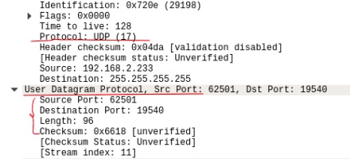
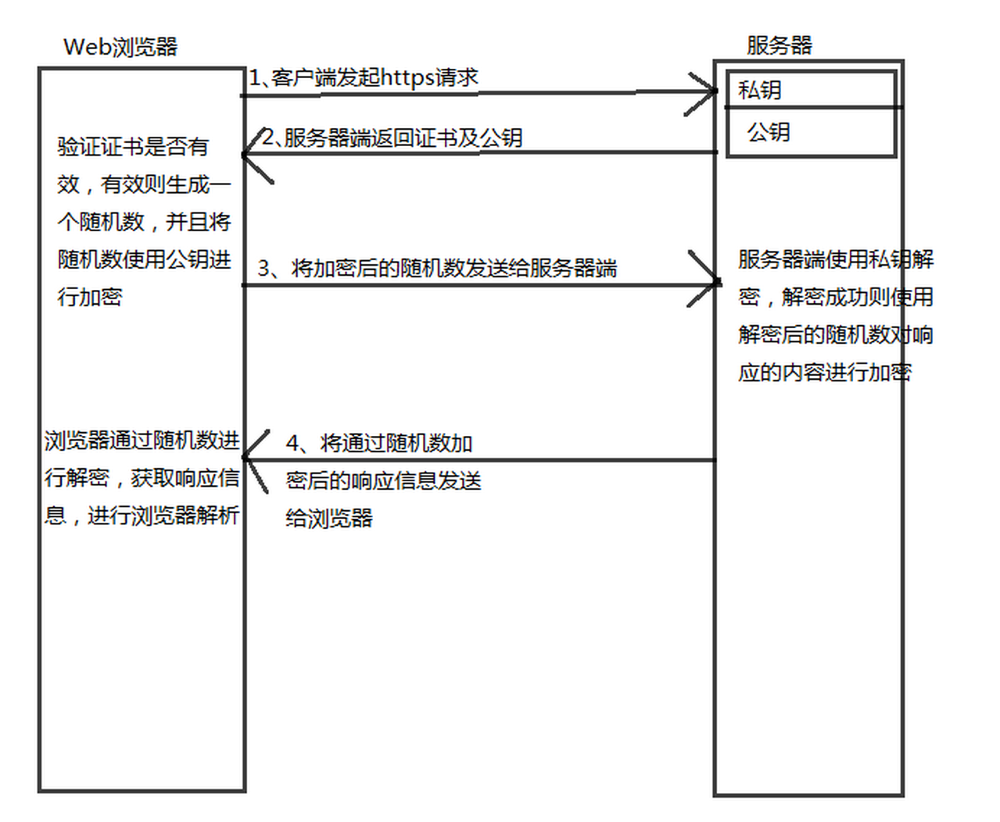

# 计算机网络

## HTTP

### 什么是Http协议

客户端和服务器端之间数据传输的格式规范，格式简称为“超文本传输协议”。

### HTTP协议与TCP/IP协议的关系

HTTP的长连接和短连接本质上是TCP长连接和短连接。
HTTP属于应用层协议，在传输层使用TCP协议，在网络层使用IP协议。 IP协议主要解决网络路由和寻址问题，TCP协议主要解决如何在IP层之上可靠地传递数据包，使得网络上接收端收到发送端所发出的所有包，并且顺序与发送顺序一致。TCP协议是可靠的、面向连接的。

### Http协议有哪些特征?

1、支持客户/服务器模式；
2、简单快速；
3、灵活；
4、无连接；
5、无状态；

### 如何理解HTTP协议是无状态的

HTTP协议是无状态的，指的是协议对于事务处理没有记忆能力，服务器不知道客户端是什么状态。也就是说，打开一个服务器上的网页和上一次打开这个服务器上的网页之间没有任何联系。HTTP是一个无状态的面向连接的协议，无状态不代表HTTP不能保持TCP连接，更不能代表HTTP使用的是UDP协议（无连接）。

### Http协议首部字段

a、通用首部字段（请求报文与响应报文都会使用的首部字段）
Date：创建报文时间
Connection：连接的管理
Cache-Control：缓存的控制
Transfer-Encoding：报文主体的传输编码方式

b、请求首部字段（请求报文会使用的首部字段）
Host：请求资源所在服务器
Accept：可处理的媒体类型
Accept-Charset：可接收的字符集
Accept-Encoding：可接受的内容编码
Accept-Language：可接受的自然语言

c、响应首部字段（响应报文会使用的首部字段）
Accept-Ranges：可接受的字节范围
Location：令客户端重新定向到的URI
Server：HTTP服务器的安装信息

d、实体首部字段（请求报文与响应报文的的实体部分使用的首部字段）
Allow：资源可支持的HTTP方法
Content-Type：实体主类的类型
Content-Encoding：实体主体适用的编码方式
Content-Language：实体主体的自然语言
Content-Length：实体主体的的字节数
Content-Range：实体主体的位置范围，一般用于发出部分请求时使用

### HTTP状态码，你知道哪些

200：请求被正常处理
204：请求被受理但没有资源可以返回
206：客户端只是请求资源的一部分，服务器只对请求的部分资源执行GET方法，相应报文中通过Content-Range指定范围的资源。
301：永久性重定向
302：临时重定向
303：与302状态码有相似功能，只是它希望客户端在请求一个URI的时候，能通过GET方法重定向到另一个URI上
304：发送附带条件的请求时，条件不满足时返回，与重定向无关
307：临时重定向，与302类似，只是强制要求使用POST方法
400：请求报文语法有误，服务器无法识别
401：请求需要认证
403：请求的对应资源禁止被访问
404：服务器无法找到对应资源
500：服务器内部错误
503：服务器正忙

### POST和GET的区别

| 操作方式 | 数据位置 | 明文密文 | 数据安全 | 长度限制         | 应用场景 |
| -------- | -------- | -------- | -------- | ---------------- | -------- |
| GET      | HTTP包头 | 明文     | 不安全   | 长度较小         | 查询数据 |
| POST     | HTTP正文 | 可明可密 | 安全     | 支持较大数据传输 | 修改数据 |

### Cookie和Session的区别

- **session**

  由于http协议是无状态的协议，所以当服务端需要记录用户的状态时，就需要用某种机制来识别具体的用户，这个机制就是session。这个机制就是session，典型的场景比如购物车，当点击收藏按钮时，由于http协议无状态，所以不知道是哪个用户操作的，所以服务端需要创建session来标识这个用户并且跟踪用户，这样才可以知道购物车里的东西。session是保存在服务端的，会有一个唯一的sessionID来识别。

- **cookie**

  sessionID是存在cookie中的，而cookie存放在客户端，当cookie把sessionID发送到服务器，服务器就会识别出指定的客户。即大多数的应用都是用cookie来实现session跟踪的，但如果浏览器禁用了cookie，一般会使用URL重写的技术来进行会话跟踪，（url+sid=xxx），服务端据此来识别用户。

  - session存在服务器端（文件、数据库、内存里），cookie在客户端（浏览器）
  - session的运行依赖sessionID，而sessionID是存在cookie中的
  - 用户验证一般会用session
  - cookie不是很安全，可以进行cookie**欺骗**

##  ICMP

互联网控制消息协议，承担网络层通信差错检测和报告机制的协议，ping命令就是基于ICMP协议来验证网络层连通性的工具。

##  TCP协议

TCP协议能够对自己提供的连接实施控制，是一种可靠的传输层协议，传输层协议最本质的任务就是把网络层协议提供的终端之间的通信服务，扩展到终端系统中运行的应用程序之间。也就是说在为应用进程建立通信之前，TCP需要首次建立传输数据所需的连接，一旦TCP连接建立成功，应用进程之间就可以通过这条TCP连接相互发送上层数据了。

###  TCP是通过什么方式来提供可靠传播的

- 对数据进行分割和充足：TCP能够将数据分割为适当大小进行传输。
- 确保数据按顺序传输：会为自己发出的数据标明序列号。
- 同时为多个应用程序提供传输服务：通过端口号把应用进程和数据的对应关系搞清楚。
- 确保接收方收到数据并按需重传：TCP要求接收方在接收到数据后，对发送方进行确认，如果发送方未收到确认标志或超出时间（当TCP发出一个段后，会启动一个定时器），那么发送方将会再次发送数据。
- 控制传输速率：使用滑动窗口机制，使接收方能够调节发送方的发送速率。
- 拥塞控制：当网络拥塞时，减少数据的发送。

####  拥塞控制

若对网络中某一资源的需求超过了该资源所能提供的可用部分，网络的性能就要变坏，这种情况就叫做拥塞。拥塞控制就是为了防止过多的数据注入到网络中，这样就可以使网络中的路由器或链路不致过载。拥塞控制所要做的都有一个前提，就是网络能够承受现有的网络负荷。

为了进行拥塞控制，TCP发送方要维持一个拥塞窗口的状态变量，拥塞控制窗口的大小取决于网络的拥塞程度，并且动态变化，发送方让自己的发送窗口取为拥塞窗口和接收方的接受窗口中较小的一个。

TCP的拥塞控制采用了四种算法，即慢开始、拥塞避免、快重传和快恢复。

- 慢开始：当主机开始发送数据时，如果立即把大量数据字节注入到网络，那么可能会引起网络阻塞，因为还不知道网络的实际情况。然后从小到大增大拥塞窗口的值。
- 拥塞避免：让拥塞窗口cwnd缓慢增大，每经过一个往返时间就把发送方的cwnd+1。
- 快重传与快恢复：能够快速恢复丢失的数据包，如果接收方接收到一个不按顺序的数据段，会立即给发送方发送一个重复确认，如果发送方收到三个重复确认，它会假定数据段丢失了，并立即重传这些丢失的数据段。如果没有该算法，就会有定时器来进行确认，会耽误时间。

###  TCP头部

- 源端口：源设备上应用进程所使用的TCP端口号
- 目的端口：指明目的设备上应用进程所使用的TCP端口号
- 序列号：表示发送数据的位置
  - 保证报文按序到达
  - 保证可靠性
  - 保证效率
  - 精确的报告哪些收到，哪些需要重传
- 确认号：确认已收到的数据
- 头部长度：标识TCP头部的总长度
- 窗口大小：接收多少字节的数据

###  TCP连接

TCP建立的是双向连接，当客户端与服务器之间数据传输完毕后，TCP会拆除已建立的连接。

####  三次握手过程

- 客户端向服务器发送TCP连接建立请求
- 服务器向客户端返回标识了SYN和ACK的数据段
- 客户端向服务器发送ACK数据段进行响应

####  意义

- 确保接收方收到了发送方的数据
- 发送方按照接收方的处理能力发送数据，避免不必要的丢包重传

####  为什么要三次握手

三次握手最主要的目的就是双方确认自己与对方的发送和接收是正常的。

- 第一次：Client什么都不能确认；Server确认对方发送正常，自己接收正常。
- 第二次：Client确认自己发送、接收正常，对方发送、接收正常；Server确认对方发送正常，自己接收正常。
- 第三次：Client确认自己发送、接收正常，对方发送、接收正常；Server确认对方发送、接收正常，自己发送、接收正常。

####  为什么要传回SYN

传回SYN是为了告诉发送端，我收到的信息就是你发送的信号。

####  四次挥手过程

- 客户端向服务器发送请求中断连接（FIN）
- 服务器向客户端发送ACK表示请求收到，客户端进入请求等待状态
- 服务器向客户端发送中断请求
- 客户端收到后发送ACK表示收到，进入TIME_WAIT状态（如果服务器没有收到ACK则重传，等待时间到后没有收到重传信息，则说明服务器已经关闭）

###  应用场景

当对网络通讯质量有要求的时候，比如：整个数据要准确无误的传递给对方，这往往用于一些要求可靠的应用，比如HTTP、HTTPS、FTP等传输文件的协议，POP、SMTP等邮件传输的协议

##  UDP协议

用户数据报协议，是一种无连接的传输层协议，提供面向事务的简单不可靠信息传送服务，提供了无连接通信，且不对传送数据包进行可靠性保证，适合一次传输少量数据，UDP的可靠性由应用层负责。

###  特点

- UDP无连接，时间上不存在建立连接需要的时延。不维护连接状态，也不跟踪这些参数，开销小。
- UDP首部开销小：TCP首部20字节，UDP8个字节。
- UDP没有拥塞控制：应用层能够更好的控制要发送的数据和发送时间，能容忍一些数据的丢失，但是不能允许有较大的时延。
- UDP提供最大努力的交付：不保证可靠交付，所有维护传输可靠性的工作需要用户在应用层完成。
- UDP是面向报文的：对应用层交下来的报文，添加首部后直接向下交付给网络层，对网络层传输上的数据报去除首部后就原封不动交给上层。
- UDP常用一次性传输比较少量数据的网络应用：如DNS、SNMP等，若采用TCP，为连接的创建、维护和拆除带来不小的开销。

可以看到，UDP其实就是在IP报文中添加了端口信息，使数据到达主机后送达相应端口的应用程序。

###  UDP使用

在选择使用协议的时候，选择UDP必须要谨慎。在网络质量令人十分不满意的环境下，UDP协议数据包丢失会比较严重。但是由于UDP的特性：它不属于连接型协议，因而具有资源消耗小、处理速度快的特点，所以通常音频、视频和普通数据在传送时使用UDP较多，因为它们即使偶尔丢失一两个数据包，也不会对接收结果产生太大影响。

TCP协议中植入了各种安全保障功能，但是在实际执行的过程中会占用大量的系统开销，无疑使速度受到严重的影响。反观UDP由于排除了消息可靠传递机制，将安全和排序等功能移交给上层应用来完成，极大降低了执行时间，使速度得到了保证。

###  

##  各层功能简述

传输层：建立端口到端口的通信。

网络层：建立主机到主机的通信

数据链路层：两台主机之间的数据传输，总是在一段一段的链路上传输的，这就需要使用专门的链路层协议。在两个节点传送数据时，数据链路层将网络层交下来的IP数据包组装成帧，在两个节点的链路上传送帧，每一帧包括数据和必要的控制信息。

物理层：把两台计算机连起来，然后在计算机之间通过高低电频来传送0，1电信号，尽可能屏蔽掉具体传输介质和物理设备的差异。

## HTTPS

###  ssl四次握手过程

- 客户端发出加密通信请求（ClientHello）
- 服务器收到客户端请求后作出响应（ServerHello）
- 客户端收到服务器回应以后，首先验证服务器证书，如果证书不是可信机构颁布、证书中的域名与实际中的域名不一致、证书已过期，就会向访问者显示警告，由其选择是否还要继续通信。
- 服务器收到客户端的第三个随机数pre-master key之后，计算生成本次会话所用的“会话密钥”。然后发送如下信息：
  1. 编码改变通知，表示随后的信息都将用双方商定的加密方法和密钥发送
  2. 服务器握手结束通知，表示服务器的握手阶段已经结束。这一项也是前面发送的所有内容的hash值，用来供客户端校验。

至此，整个握手阶段结束，接下来就会使用加密后的http协议来进行通信。

##  DNS寻址过程

- 首先会检查本地hosts文件是否有这个映射关系，如果有，就优先调用。
- 如果hosts里没有，则会在本地DNS解析器缓存，查看是否有网址映射关系。
- 如果没有，继续查TCP/IP参数中设置的首选DNS服务器（本地）。此服务器收到查询时，如果要查询的域名包含在本地配置中，则返回解析结果给客户机，完成域名解析；如果不在本地，但该服务器已缓存了此网址映射关系，则调用这个IP地址映射，完成域名解析，此解析不具有权威性。
- 如果都失效，则根据本地DNS服务器设置进行查询，然后从.com进行解析，如果自己无法解析，就会下一级qq.com给本地DNS服务器，直至找到www.qq.com主机（未用转发模式）；如果是转发模式，就会把请求转发至上一级DNS服务器，由上一级服务器进行解析，如果不能解析，就会转至上上级，以此循环。

## IP地址

- 前28位为网络号，故子网掩码为11111111.11111111. 11111111. 11110000（255.255.255.240）。

  256-240=16，有16个子网，每一个子网段大小范围是16。