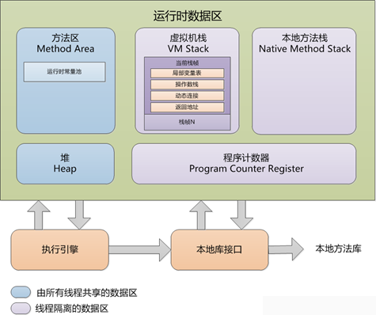
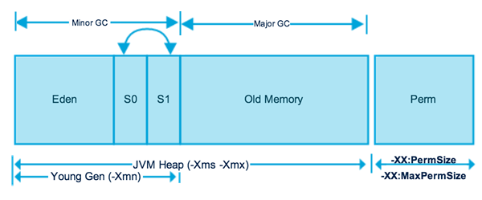
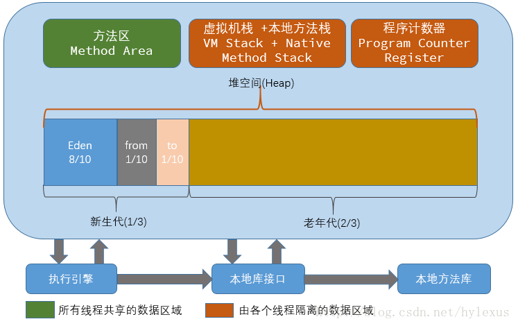

# Java基础


## 封装 继承 多态

- **覆盖/重写**

- **重载**

- **java中的强制类型转换只是针对单个对象的，想要偷懒将整个数组转换成另外一种类型的数组是不行的，这和数组初始化时需要一个个来也是类似的**

- **向上转型**

  ```java
  Father f = new Son();
  ```

  

- **强制向下转型**

  父类必须实际指向了一个子类对象才可强制类型向下转型

  ```java
  Father f = new Son();
  Son s = (Son)f;
  ```

- **子类的构造方法总是先调用父类的构造方法，如果子类的构造方法没有明显地指明使用父类的哪个构造方法，子类就调用父类不带参数的构造方法。**
  **而父类没有无参的构造函数，所以子类需要在自己的构造函数中显示的调用父类的构造函数。**
  
- **final类不能用来派生子类，因为用final修饰的类不能被继承**

## **抽象类和接口**


### 区别

- 抽象类中可以没有抽象方法，也可以抽象方法和非抽象方法共存
- 接口中的方法在JDK8之前只能是抽象的，JDK8版本开始提供了接口中方法的default实现
- 抽象类和类一样是单继承的；接口可以实现多个父接口
- 抽象类中可以存在普通的成员变量；接口中的变量必须是static final类型的，必须被初始化，接口中只有常量，没有变量

### 使用情况

- 当需要定义一些抽象方法而不需要其余额外的具体方法或者变量的时候，我们可以使用接口；反之，则需要使用抽象类


## Java中的8种基本数据类型及其取值范围

- byte：1字节
- short：2字节
- int：4个字节
- long：8字节
- float：4字节
- double：8字节
- char：2字节

- boolean：Java规范中并没有规定boolean类型所占字节数
- int的取值范围为 Integer.MIN_VALUE 到 Integer.MAX_VALUE

- **java中整型默认的是int,浮点默认的是double.**

- **Java一律采用Unicode编码方式，每个字符无论中文还是英文字符都占用2个字节**
- switch 支持  byte、short、char、int、Enum（1.7之前）  String(1.7之后)

## 元注解

**作用**:负责注解其它注解


### Target

- 说明注解所修饰的对象范围

- ```java
  public enum ElementType { 
    TYPE,FIELD,METHOD,PARAMETED,CONSTRUCTOR,LOCAL_VARIABLE,ANNOCATION_TYPE,PACKAGE,TYPE_PARAMETER,TYPE_USE 
  } 
  @Target({ElementType.TYPE, ElementType.METHOD}) 
  ```

  

### Retention（保留策略）

- 定义了该注解被保留的时间长短

- ```java
  public enum RetentionPolicy { 
      SOURCE, CLASS, RUNTIME 
  }
  //SOURCE：表示在源文件中有效（即源文件保留）
  //CLASS：表示在class文件中有效（即class保留）
  //RUNTIME：表示在运行时有效（即运行时保留）
  @Retention(RetentionPolicy.RUNTIME)
  ```


###  Documented

- 描述其它类型的annotation应该被作为被标注的程序成员的公共API，因此可以被javadoc此类的工具文档化，是一个标记注解，没有成员


### Inherited

- 是一个标记注解，@Inherited阐述了某个被标注的类型是被继承的。如果一个使用了@Inherited修饰的annotation类型被用于一个class，则这个annotation将被用于该class的子类

## static

**static修饰的方法，无this指针**


## 泛型

- 泛型有三种使用方式，分别为：泛型类、泛型接口、泛型方法

- 在编译之后程序会采取去泛型化的措施。也就是说Java中的泛型，只在编译阶段有效。在编译过程中，正确检验泛型结果后，会将泛型的相关信息擦出，并且在对象进入和离开方法的边界处添加类型检查和类型转换的方法。也就是说，泛型信息不会进入到运行时阶段。

  **泛型类型在逻辑上看以看成是多个不同的类型，实际上都是相同的基本类型**

- ```java
  //泛型类
  public class Generic<T>{ 
      //key这个成员变量的类型为T,T的类型由外部指定  
      private T key;
  
      public Generic(T key) { //泛型构造方法形参key的类型也为T，T的类型由外部指定
          this.key = key;
      }
  
      public T getKey(){ //泛型方法getKey的返回值类型为T，T的类型由外部指定
          return key;
      }
  }
  
  //定义一个泛型接口
  public interface Generator<T> {
      public T next();
  }
  class FruitGenerator<T> implements Generator<T>{
      @Override
      public T next() {
          return null;
      }
  }
  public class FruitGenerator implements Generator<String> {
  
      private String[] fruits = new String[]{"Apple", "Banana", "Pear"};
  
      @Override
      public String next() {
          Random rand = new Random();
          return f
              ruits[rand.nextInt(3)];
      }
  }
  ```

- **未传入泛型实参时，与泛型类的定义相同，在声明类的时候，需将泛型的声明也一起加到类中**

  **实现类实现泛型接口时，如已将泛型类型传入实参类型，则所有使用泛型的地方都要替换成传入的实参类型**

- ```java
  Generic<?> obj
  ```

  泛型通配符，可以把？看成所有类型的父类。是一种真实的类型。

- ```java
  /**
   * 泛型方法的基本介绍
   * @param tClass 传入的泛型实参
   * @return T 返回值为T类型
   * 说明：
   *     1）public 与 返回值中间<T>非常重要，可以理解为声明此方法为泛型方法。
   *     2）只有声明了<T>的方法才是泛型方法，泛型类中的使用了泛型的成员方法并不是泛型方法。
   *     3）<T>表明该方法将使用泛型类型T，此时才可以在方法中使用泛型类型T。
   *     4）与泛型类的定义一样，此处T可以随便写为任意标识，常见的如T、E、K、V等形式的参数常用于表示泛型。
   */
  public <T> T genericMethod(Class<T> tClass)throws InstantiationException ,
    IllegalAccessException{
          T instance = tClass.newInstance();
          return instance;
  }
  Object obj = genericMethod(Class.forName("com.test.test"));
  ```

  **泛型方法**可以出现杂任何地方和任何场景中使用

- 泛型方法与可变参数

  ```java
  public <T> void printMsg( T... args){
      for(T t : args){
          Log.d("泛型测试","t is " + t);
      }
  }
  printMsg("111",222,"aaaa","2323.4",55.55);
  ```

- 静态方法 用到泛型必须声明

## 反射机制


### 定义

- **反射机制**是指在运行中，对于任意一个类，都能够知道这个类的所有属性和方法。对于任意一个对象，都能够调用它的任意一个方法和属性。即**动态获取信息和动态调用对象方法的功能**称为反射机制。


### 作用

- 在运行时判断任意一个对象所属的类
- 在运行时构造一个类的对象
- 在运行时判断任意一个类所具有的成员变量和方法
- 在运行时调用任意一个对象的方法，生成动态代理


### 相关的类

- **Class：表示类**，用于获取类的相关信息
- **Field：表示成员变量**，用于获取实例变量和静态变量等
- **Method：表示方法**，用于获取类中的方法参数和方法类型等
- **Constructor：表示构造器**，用于获取构造器的相关参数和类型等


## 异常


### Exception和Error的区别

- **Exception**是程序正常运行中**预料到可能会出现**的错误，并且应该被捕获并进行相应的处理，是一种**异常**现象
- **Error**是正常情况下不可能发生的错误，**Error会导致JVM处于一种不可恢复的状态**，不需要捕获处理，比如说OutOfMemoryError


## 值传递和引用传递

- **值传递，**意味着传递了对象的一个副本，即使副本被改变，也不会影响源对象。
- **引用传递，**意味着传递的并不是实际的对象，而是对象的引用。因此，外部对引用对象的改变会反映到所有的对象上。


## 三大集合


### 常见集合

Java中的常见集合可以概括如下。

- **Map接口和Collection接口是所有集合框架的父接口**
- Collection接口的子接口包括：Set接口和List接口
- Map接口的实现类主要有：**HashMap**、TreeMap、Hashtable、LinkedHashMap、**ConcurrentHashMap**以及Properties等
- Set接口的实现类主要有：HashSet、TreeSet、LinkedHashSet等
- List接口的实现类主要有：**ArrayList**、**LinkedList**、Stack以及Vector等


### HashMap和Hashtable的区别

HashMap和Hashtable之间的区别可以总结如下。

- HashMap没有考虑同步，是线程不安全的；Hashtable使用了synchronized关键字，是线程安全的；
- HashMap允许null作为Key；Hashtable不允许null作为Key，Hashtable的value也不可以为null


### ConcurrentHashMap和Hashtable的区别

- **ConcurrentHashMap结合了HashMap和Hashtable二者的优势。**HashMap没有考虑同步，Hashtable考虑了同步的问题。但是Hashtable在每次同步执行时都要锁住整个结构。

- ConcurrentHashMap锁的方式是稍微细粒度的，ConcurrentHashMap将hash表分为16个桶（默认值），诸如get，put，remove等常用操作只锁上当前需要用到的桶。
- **单线程环境下可以使用HashMap，多线程环境下可以使用ConcurrentHashMap**


### 快速失败（fast-fail）机制

- HashMap和Hashtable都有fast-fail（Hashtable本身虽然线程安全,但是对Hashtable返回的任何形式collection使用Iterator都是会快速失败的）。
- 快速失败是Java集合的一种**错误检测机制**，当多个线程对集合进行结构上的改变的操作时，**有可能**会产生fail-fast。

- 异常的抛出条件是检测到 modCount != expectedmodCount。
- 场景：java.util包下的集合类都是快速失败的，不能在多线程下发生并发修改（迭代过程中被修改）。


### 安全失败（fail—safe）机制

- 原理：迭代时是对原集合的拷贝进行遍历。
- 场景：java.util.concurrent包下的容器都是安全失败，可以在多线程下并发使用，并发修改。


### HashMap

- 底层实现：HashMap底层实现数据结构为**数组+链表**的形式，JDK8及其以后的版本中使用了**数组+链表+红黑树**实现，解决了链表太长导致的查询速度变慢的问题。

- HashMap的初始容量16，加载因子为0.75，扩容增量是原容量的1倍。如果HashMap的容量为16，一次扩容后容量为32。HashMap扩容是指元素个数**（包括数组和链表+红黑树中）**超过了16*0.75=12之后开始扩容。

- 将一个键值对插入HashMap中，通过**将Key的hash值与length-1进行&运算**，实现了当前Key的定位，2的幂次方的容量可以减少冲突（碰撞）的次数，提高HashMap查询效率。

- 加载因子，如果设置太小不利于空间利用，设置太大则会导致碰撞增多，降低了查询效率，所以设置了0.75。

- ### HasMap的存储和获取原理：

  - 当**调用put()方法传递键和值来存储时**，先对键调用hashCode()方法，返回的hashCode用于**找到bucket位置来储存Entry对象**，也就是找到了该元素应该被存储的**桶中（数组）**。当两个键的hashCode值相同时，bucket位置发生了冲突，也就是**发生了Hash冲突**，这个时候，会在每一个bucket后边接上一个链表（JDK8及以后的版本中还会加上红黑树）来解决，将新存储的键值对放在表头（也就是bucket中）。

  - 当调用get方法**获取存储的值**时，首先根据键的hashCode找到对应的bucket，然后根据equals方法来在链表和红黑树中找到对应的值。

- ### HasMap的扩容步骤：

  HashMap里面默认的负载因子大小为0.75，也就是说，当Map中的元素个数**（包括数组，链表和红黑树中）**超过了16*0.75=12之后开始扩容。将会创建原来HashMap大小的两倍的bucket数组，来重新调整map的大小，并将原来的对象放入新的bucket数组中。这个过程叫作**rehashing**，因为它调用hash方法找到新的bucket位置。

- ### 解决Hash冲突的方法：

  - 拉链法 **（HashMap使用的方法）**
  - 线性探测再散列法
  - 二次探测再散列法
  - 伪随机探测再散列法

- ### 适合作为HashMap的键的类：

  String和Interger这样的包装类

  - final类型的类，而且**重写了equals和hashCode方法**，避免了键值对改写，有效提高HashMap性能


### ConcurrentHashMap的具体实现方式(分段锁):

- 该类包含两个**静态内部类MapEntry和Segment**，前者用来封装映射表的键值对，后者用来充当锁的角色
- **Segment**是一种**可重入的锁ReentrantLock**，每个Segment守护一个HashEntry数组里得元素，当对HashEntry数组的数据进行修改时，必须首先获得对应的Segment锁。

### TreeMap

- **特性**

  - TreeMap底层使用**红黑树**实现，TreeMap中存储的键值对**按照键来排序**。

  - 如果Key存入的是字符串等类型，那么会按照字典默认顺序排序

  - 如果传入的是自定义引用类型，比如说User，那么该对象必须实现Comparable接口，并且覆盖其compareTo方法；创建TreeMap的时候，我们必须指定使用的比较器

    ```java
    // 方式一：定义该类的时候，就指定比较规则
    class User implements Comparable{
        @Override
        public int compareTo(Object o) {
            // 在这里边定义其比较规则
            return 0;
        }
    }
    public static void main(String[] args) {
        // 方式二：创建TreeMap的时候，可以指定比较规则
        new TreeMap<User, Integer>(new Comparator<User>() {
            @Override
            public int compare(User o1, User o2) {
                // 在这里边定义其比较规则
                return 0;
            }
        });
    }
    ```

### Comparable接口和Comparator接口有哪些区别呢？

- Comparable实现比较简单，但是当需要重新定义比较规则的时候，**必须修改源代码**，即修改User类里边的compareTo方法
- Comparator接口不需要修改源代码，只需要在创建TreeMap的时候**重新传入一个具有指定规则的比较器**即可。

### ArrayList和LinkedList有哪些区别？

- ArrayList底层使用了**动态数组**实现，实质上是一个动态数组
- LinkedList底层使用了**双向链表**实现，可当作堆栈、队列、双端队列使用
- ArrayList在**随机存取**方面效率高于LinkedList
- LinkedList在节点的**增删方面**效率高于ArrayList
- ArrayList必须预留一定的空间，当空间不足的时候，会进行扩容操作
- LinkedList的开销是必须存储节点的信息以及节点的指针信息
- **Vector**，它**是线程安全的ArrayList**，但是已经被废弃，不推荐使用了。多线程环境下，我们可以使用CopyOnWriteArrayList替代ArrayList来保证线程安全

###  HashSet和TreeSet有哪些区别？

- **HashSet底层使用了Hash表实现。**

保证元素唯一性的原理：判断元素的hashCode值是否相同。如果相同，还会继续判断元素的equals方法，是否为true

- **TreeSet底层使用了红黑树来实现。**

保证元素唯一性是通过Comparable或者Comparator接口实现


### LinkedHashMap和LinkedHashSet

**LinkedHashMap可以记录下元素的插入顺序和访问顺序**，具体实现如下：

- LinkedHashMap内部的Entry继承于HashMap.Node，这两个类都实现了Map.Entry<K,V>
- LinkedHashMap的Entry不光有value，next，还有before和after属性，这样通过一个双向链表，**保证了各个元素的插入顺序**
- 通过构造方法public LinkedHashMap(int initialCapacity,float loadFactor,boolean accessOrder)， **accessOrder传入true可以实现LRU缓存算法（访问顺序）**
- **LinkedHashSet 底层使用LinkedHashMap实现**，两者的关系类似与HashMap和HashSet的关系

**LRU（Least recently used，最近最少使用）算法**根据数据的历史访问记录来进行淘汰数据，其核心思想是“如果数据最近被访问过，那么将来被访问的几率也更高”。

### List和Set的区别

- List是有序的并且元素是**可以重复**的
- Set是无序（LinkedHashSet除外）的，并且元素是**不可以重复**的
  （此处的有序和无序是指**放入顺序和取出顺序**是否保持一致）

### Iterator和ListIterator的区别

- Iterator可以遍历list和set集合；ListIterator只能用来遍历list集合
- Iterator前者只能前向遍历集合；ListIterator可以前向和后向遍历集合
- ListIterator其实就是实现了前者，并且增加了一些新的功能。

### 数组和集合List之间的转换

- ### 数组转为集合List：

  - 通过Arrays.asList方法搞定，转换之后不可以使用add/remove等修改集合的相关方法，因为该方法返回的**其实是一个Arrays的内部私有的一个类ArrayList**，该类继承于Abstractlist，并没有实现这些操作方法，调用将会直接抛出UnsupportOperationException异常。这种转换体现的是一种**适配器模式**，只是转换接口，本质上还是一个数组。

- ### 集合转换数组：

  - List.toArray方法搞定了集合转换成数组，这里**最好传入一个类型一样的数组**，大小就是list.size()。因为如果入参分配的数组空间不够大时，toArray方法内部将重新分配内存空间，并返回新数组地址；如果数组元素个数大于实际所需，下标为list.size()及其之后的数组元素将被置为null，其它数组元素保持原值。所以，建议该方法入参数组的大小与集合元素个数保持一致。

  - 若是**直接使用toArray无参方法**，此方法返回值只能是Object[ ]类，若强转其它类型数组将出现**ClassCastException**错误。

### Collection和Collections

- Collection是一个顶层集合接口，其子接口包括List和Set；
- Collections是一个集合工具类，可以操作集合，比如说排序，二分查找，拷贝集合，寻找最大最小值等。 
- 总而言之：带s的大都是工具类。

## JVM

### Java运行时数据区

- Java虚拟机在执行Java程序的过程中会将其管理的内存划分为若干个不同的数据区域，这些区域有各自的用途、创建和销毁的时间，有些区域随虚拟机进程的启动而存在，有些区域则是依赖用户线程的启动和结束来建立和销毁。Java虚拟机所管理的内存包括以下几个运行时数据区域

  

  - 程序计数器：指向当前线程正在执行的字节码指令。线程私有的。

  - 虚拟机栈：虚拟机栈是Java执行方法的内存模型。每个方法被执行的时候，都会创建一个栈帧，把栈帧压入栈，当方法正常返回或者抛出未捕获的异常时，栈帧就会出栈。

    - 栈帧：栈帧存储方法的相关信息，包含局部变量数表、返回值、操作数栈、动态链接
      - 局部变量表：包含了方法执行过程中的所有变量。局部变量数组所需要的空间在编译期间完成分配，在方法运行期间不会改变局部变量数组的大小。
      - 返回值：如果有返回值的话，压入调用者栈帧中的操作数栈中，并且把PC的值指向 方法调用指令 后面的一条指令地址。
      - 操作数栈：操作变量的内存模型。操作数栈的最大深度在编译的时候已经确定（写入方法区code属性的max_stacks项中）。操作数栈的的元素可以是任意Java类型，包括long和double，32位数据占用栈空间为1，64位数据占用2。方法刚开始执行的时候，栈是空的，当方法执行过程中，各种字节码指令往栈中存取数据。
      - 动态链接：每个栈帧都持有在运行时常量池中该栈帧所属方法的引用，持有这个引用是为了支持方法调用过程中的动态链接

    - 线程私有

  - 本地方法栈：
    - 调用本地native的内存模型
    - 线程独享。
  - 方法区：用于存储已被虚拟机加载的类信息、常量、静态变量、即时编译后的代码等数据
    - 线程共享的
    - 运行时常量池：
      - 是方法区的一部分
      - 存放编译期生成的各种字面量和符号引用
      - Class文件中除了存有类的版本、字段、方法、接口等描述信息，还有一项是常量池，存有这个类的 编译期生成的各种字面量和符号引用，这部分内容将在类加载后，存放到方法区的运行时常量池中。

  - 堆（Heap）：Java对象存储的地方
    - Java堆是虚拟机管理的内存中最大的一块
    - Java堆是所有线程共享的区域
    - 在虚拟机启动时创建
    - 此内存区域的唯一目的就是存放对象实例，几乎所有对象实例都在这里分配内存。存放new生成的对象和数组
    - Java堆是垃圾收集器管理的内存区域，因此很多时候称为“GC堆”

### **JMM Java内存模型**

- Java的并发采用“共享内存”模型，线程之间通过读写内存的公共状态进行通讯。多个线程之间是不能通过直接传递数据交互的，它们之间交互只能通过共享变量实现。
- 主要目的是定义程序中各个变量的访问规则。
-  Java内存模型规定所有变量都存储在主内存中，每个线程还有自己的工作内存。
  - 线程的工作内存中保存了被该线程使用到的变量的拷贝（从主内存中拷贝过来），线程对变量的所有操作都必须在工作内存中执行，而不能直接访问主内存中的变量。
  - 不同线程之间无法直接访问对方工作内存的变量，线程间变量值的传递都要通过主内存来完成。
  - 主内存主要对应Java堆中实例数据部分。工作内存对应于虚拟机栈中部分区域。


- Java线程之间的通信由内存模型JMM（Java Memory Model）控制。
  - JMM决定一个线程对变量的写入何时对另一个线程可见。
  - 线程之间共享变量存储在主内存中
  - 每个线程有一个私有的本地内存，里面存储了读/写共享变量的副本。
  - JMM通过控制每个线程的本地内存之间的交互，来为程序员提供内存可见性保证。

- 可见性、有序性：
  - 当一个共享变量在多个本地内存中有副本时，如果一个本地内存修改了该变量的副本，其他变量应该能够看到修改后的值，此为可见性。
  - 保证线程的有序执行，这个为有序性。（保证线程安全）

- 内存间交互操作：
  - lock（锁定）：作用于主内存的变量，把一个变量标识为一条线程独占状态。
  - unlock（解锁）：作用于主内存的变量，把一个处于锁定状态的变量释放出来，释放后的变量才可以被其他线程锁定。
  - read（读取）：作用于主内存变量，把主内存的一个变量读取到工作内存中。
  - load（载入）：作用于工作内存，把read操作读取到工作内存的变量载入到工作内存的变量副本
  - use（使用）：作用于工作内存的变量，把工作内存中的变量值传递给一个执行引擎。
  - assign（赋值）：作用于工作内存的变量。把执行引擎接收到的值赋值给工作内存的变量。
  - store（存储）：把工作内存的变量的值传递给主内存
  - write（写入）：把store操作的值入到主内存的变量中
  - 注意：
    - 不允许read、load、store、write操作之一单独出现
    - 不允许一个线程丢弃assgin操作
    - 不允许一个线程不经过assgin操作，就把工作内存中的值同步到主内存中
    - 一个新的变量只能在主内存中生成
    - 一个变量同一时刻只允许一条线程对其进行lock操作。但lock操作可以被同一条线程执行多次，只有执行相同次数的unlock操作，变量才会解锁
    - 如果对一个变量进行lock操作，将会清空工作内存中此变量的值，在执行引擎使用这个变量前，需要重新执行load或者assgin操作初始化变量的值。
    - 如果一个变量没有被锁定，不允许对其执行unlock操作，也不允许unlock一个被其他线程锁定的变量
    - 对一个变量执行unlock操作之前，需要将该变量同步回主内中

### 堆的内存划分：


Java堆的内存划分如图所示，分别为年轻代、Old Memory（老年代）、Perm（永久代）。其中在Jdk1.8中，永久代被移除，使用MetaSpace代替。

- JVM分代

  - **概念**：JVM根据对象存活周期不同，把堆内存划分为几块。新生代、老年代、永久代。

  - **分代原因**：堆内存存放对象实例，是JVM管理的内存中最大一块，也是垃圾回收最频繁的一块。分代是为了提高对象内存分配和垃圾回收的效率。

  - **分代原则**：

    - 新生代：新创建的对象。会被频繁得GC(垃圾回收)。

      新生代分为三块，Eden（占内存80%），From survivor（占内存10%），To survivor（占内存10%）,原因是hotspot采用复制算法回收新生代，这样可以充分利用内存空间，减少浪费。

      处理流程：

      - 判断该对象是否是大对象，大对象直接进入老年代
      - 如果不是大对象，会存储在Eden区。To survivor是空的
      - 执行GC , Eden和From survivor区中存活下来的对象存在To survivor区
      - From survivor和To survivor调换身份。这样To survivor又是空的了。

    - 老年代：新创建的对象。经过了多次GC依然存活。不会频繁做GC。

    - 永久代：静态属性、类信息。一般不做GC。

- 堆内存的划分在JVM里面的示意图

### GC垃圾回收：

- 判断对象是否要回收的方法：可达性分析法

  - 可达性分析法：通过一系列“GC Roots”对象作为起点进行搜索，如果在“GC Roots”和一个对象之间没有可达路径，则称该对象是不可达的。不可达对象不一定会成为可回收对象。进入DEAD状态的线程还可以恢复，GC不会回收它的内存。（把一些对象当做root对象，JVM认为root对象是不可回收的，并且root对象引用的对象也是不可回收的）

  - 以下对象会被认为是root对象：

    - 虚拟机栈（栈帧中本地变量表）中引用的对象 
    - 方法区中静态属性引用的对象
    - 方法区中常量引用的对象
    - 本地方法栈中Native方法引用的对象

  - 对象被判定可被回收，需要经历两个阶段：

    - 第一个阶段是可达性分析，分析该对象是否可达
    - 第二个阶段是当对象没有重写finalize()方法或者finalize()方法已经被调用过，虚拟机认为该对象不可以被救活，因此回收该对象。（finalize()方法在垃圾回收中的作用是，给该对象一次救活的机会）

  - 方法区中的垃圾回收：

    - 常量池中一些常量、符号引用没有被引用，则会被清理出常量池
    - 无用的类：被判定为无用的类，会被清理出方法区。判定方法如下：
      - 该类的所有实例被回收
      - 加载该类的ClassLoader被回收
      - 该类的Class对象没有被引用

    - finalize():
      - GC垃圾回收要回收一个对象的时候，调用该对象的finalize()方法。然后在下一次垃圾回收的时候，才去回收这个对象的内存。
      - 可以在该方法里面，指定一些对象在释放前必须执行的操作。

- 发现虚拟机频繁full GC时应该怎么办：
  （full GC指的是清理整个堆空间，包括年轻代和永久代）

  - 首先用命令查看触发GC的原因是什么 jstat –gccause 进程id 

  - 如果是System.gc()，则看下代码哪里调用了这个方法 

  - 如果是heap inspection(内存检查)，可能是哪里执行jmap –histo[:live]命令

  - 如果是GC locker，可能是程序依赖的JNI库的原因 

- 常见的垃圾回收算法：

  - Mark-Sweep（标记-清除算法）：
    - 思想：标记清除算法分为两个阶段，标记阶段和清除阶段。标记阶段任务是标记出所有需要回收的对象，清除阶段就是清除被标记对象的空间。
    - 优缺点：实现简单，容易产生内存碎片
  - Copying（复制清除算法）：
    - 思想：将可用内存划分为大小相等的两块，每次只使用其中的一块。当进行垃圾回收的时候了，把其中存活对象全部复制到另外一块中，然后把已使用的内存空间一次清空掉
    - 优缺点：不容易产生内存碎片；可用内存空间少；存活对象多的话，效率低下。

  - Mark-Compact（标记-整理算法）：
    - 思想：先标记存活对象，然后把存活对象向一边移动，然后清理掉端边界以外的内存。
    - 优缺点：不容易产生内存碎片；内存利用率高；存活对象多并且分散的时候，移动次数多，效率低下

  - 分代收集算法：（目前大部分JVM的垃圾收集器所采用的算法）：
    - 思想：把堆分成新生代和老年代。（永久代指的是方法区）
    - （1） 因为新生代每次垃圾回收都要回收大部分对象，所以新生代采用Copying算法。新生代里面分成一份较大的Eden空间和两份较小的Survivor空间。每次只使用Eden和其中一块Survivor空间，然后垃圾回收的时候，把存活对象放到未使用的Survivor（划分出from、to）空间中，清空Eden和刚才使用过的Survivor空间。
    -  由于老年代每次只回收少量的对象，因此采用mark-compact算法。
    - 在堆区外有一个永久代。对永久代的回收主要是无效的类和常量
  - GC使用时对程序的影响？
    垃圾回收会影响程序的性能，Java虚拟机必须要追踪运行程序中的有用对象，然后释放没用对象，这个过程消耗处理器时间
  - 几种不同的垃圾回收类型：
    - Minor GC：从年轻代（包括Eden、Survivor区）回收内存。
      - 当JVM无法为一个新的对象分配内存的时候，越容易触发Minor GC。所以分配率越高，内存越来越少，越频繁执行Minor GC
      - 执行Minor GC操作的时候，不会影响到永久代（Tenured）。从永久代到年轻代的引用，被当成GC Roots，从年轻代到老年代的引用在标记阶段直接被忽略掉。
    - Major GC：清理整个老年代，当eden区内存不足时触发。
    - Full GC：清理整个堆空间，包括年轻代和老年代。当老年代内存不足时触发

### 类加载机制：

- 概念：类加载器把class文件中的二进制数据读入到内存中，存放在方法区，然后在堆区创建一个java.lang.Class对象，用来封装类在方法区内的数据结构。类加载的步骤如下：
  - 加载：查找并加载类的二进制数据（把class文件里面的信息加载到内存里面）
  - 连接：把内存中类的二进制数据合并到虚拟机的运行时环境中
    - 验证：确保被加载的类的正确性。包括：   、
      - 类文件的结构检查：检查是否满足Java类文件的固定格式
      - 语义检查：确保类本身符合Java的语法规范
      - 字节码验证：确保字节码流可以被Java虚拟机安全的执行。字节码流是操作码组成的序列。每一个操作码后面都会跟着一个或者多个操作数。字节码检查这个步骤会检查每一个操作码是否合法
      - 二进制兼容性验证：确保相互引用的类之间是协调一致的。
    - 准备：为类的静态变量分配内存，并将其初始化为默认值
    - 解析：把类中的符号引用转化为直接引用（比如说方法的符号引用，是有方法名和相关描述符组成，在解析阶段，JVM把符号引用替换成一个指针，这个指针就是直接引用，它指向该类的该方法在方法区中的内存位置）
  - 初始化：为类的静态变量赋予正确的初始值。当静态变量的等号右边的值是一个常量表达式时，不会调用static代码块进行初始化。只有等号右边的值是一个运行时运算出来的值，才会调用static初始化。****
- 双亲委派模型：
  - 当一个类加载器收到类加载请求的时候，它首先不会自己去加载这个类的信息，而是把该
    请求转发给父类加载器，依次向上。所以所有的类加载请求都会被传递到父类加载器中，只有当父类加载器中无法加载到所需的类，子类加载器才会自己尝试去加载该类。当当前类加载器和所有父类加载器都无法加载该类时，抛出ClassNotFindException异常。
  - 意义：提高系统的安全性。用户自定义的类加载器不可能加载应该由父加载器加载的可靠类。（比如用户定义了一个恶意代码，自定义的类加载器首先让系统加载器去加载，系统加载器检查该代码不符合规范，于是就不继续加载了）
  - 定义类加载器：如果某个类加载器能够加载一个类，那么这个类加载器就叫做定义类加载器
  - 初始类加载器：定义类加载器及其所有子加载器都称作初始类加载器。
  - 运行时包：
    - 由同一个类加载器加载并且拥有相同包名的类组成运行时包
    - 只有属于同一个运行时包的类，才能访问包可见（default）的类和类成员。作用是 限制用户自定义的类冒充核心类库的类去访问核心类库的包可见成员。
  - 加载两份相同的class对象的情况：A和B不属于父子类加载器关系，并且各自都加载了同一个类。
- 特点：
  1、全盘负责：当一个类加载器加载一个类时，该类所依赖的其他类也会被这个类加载器加载到内存中。
  2、缓存机制：所有的Class对象都会被缓存，当程序需要使用某个Class时，类加载器先从缓存中查找，找不到，才从class文件中读取数据，转化成Class对象，存入缓存中。
- 类加载器：
  两种类型的类加载器：

  - JVM自带的类加载器（3种）：

    - 根类加载器（Bootstra p）：
      - C++编写的，程序员无法在程序中获取该类
      - 负责加载虚拟机的核心库，比如java.lang.Object
      - 没有继承ClassLoader类

    - 扩展类加载器（Extension）：

      - Java编写的，从指定目录中加载类库

      - 父加载器是根类加载器

      - 是ClassLoader的子类

      - 如果用户把创建的jar文件放到指定目录中，也会被扩展加载器加载。

    - 系统加载器（System）或者应用加载器(App)：

      - Java编写的

      - 父加载器是扩展类加载器

      - 从环境变量或者class.path中加载类

      - 是用户自定义类加载的默认父加载器

      - 是ClassLoader的子类

  - 用户自定义的类加载器：

    - Java.lang.ClassLoader类的子类
    - 用户可以定制类的加载方式
    - 父类加载器是系统加载器
    - 编写步骤：
      - 继承ClassLoader
      - 重写findClass方法。从特定位置加载class文件，得到字节数组，然后利用defineClass把字节数组转化为Class对象
    - 为什么要自定义类加载器？
      - 可以从指定位置加载class文件，比如说从数据库、云端加载class文件
      - 加密：Java代码可以被轻易的反编译，因此，如果需要对代码进行加密，那么加密以后的代码，就不能使用Java自带的ClassLoader来加载这个类了，需要自定义ClassLoader，对这个类进行解密，然后加载。

### JVM常用内存调优命令

- **jps：**主要用来输出JVM中运行的进程状态信息，一般使用jps命令来查看进程的状态信息，包括JVM启动参数等。
- **jinfo：**主要用来观察进程运行环境参数等信息。
- **jstack：**主要用来查看某个Java进程内的线程堆栈信息。jstack pid 可以看到当前进程中各个线程的状态信息，包括其持有的锁和等待的锁。
- **jmap：**用来查看堆内存使用状况。jmap -heap pid可以看到当前进程的堆信息和使用的GC收集器，包括年轻代和老年代的大小分配等
- **jstat：**进行实时命令行的监控，包括堆信息以及实时GC信息等。可以使用jstat -gcutil pid1000来每隔一秒来查看当前的GC信息。

### JVM调优之常用参数配置

**一、堆设置**

- -Xms:初始堆大小
- -Xmx:最大堆大小
- -XX:NewSize=n:设置年轻代大小
- -XX:NewRatio=n:设置年轻代和年老代的比值。如:为3，表示年轻代与年老代比值为1：3，年轻代占整个年轻代年老代和的1/4
- -XX:SurvivorRatio=n:年轻代中Eden区与两个Survivor区的比值。注意Survivor区有两个。如：3，表示Eden：Survivor=3：2，
  一个Survivor区占整个年轻代的1/5
- -XX:MaxPermSize=n:设置持久代大小

**二、收集器设置**

- -XX:+UseSerialGC:设置串行收集器
- -XX:+UseParallelGC:设置并行收集器
- -XX:+UseParalledlOldGC:设置并行年老代收集器
- -XX:+UseConcMarkSweepGC:设置并发收集器

**三、垃圾回收统计信息**

- -XX:+PrintGC
- -XX:+PrintGCDetails
- -XX:+PrintGCTimeStamps
- -Xloggc:filename

**四、并行收集器设置**

- -XX:ParallelGCThreads=n:设置并行收集器收集时使用的CPU数。并行收集线程数。
- -XX:MaxGCPauseMillis=n:设置并行收集最大暂停时间
- -XX:GCTimeRatio=n:设置垃圾回收时间占程序运行时间的百分比。公式为1/(1+n)

**五、并发收集器设置**

- -XX:+CMSIncrementalMode:设置为增量模式。适用于单CPU情况。
- -XX:ParallelGCThreads=n:设置并发收集器年轻代收集方式为并行收集时，使用的CPU数。并行收集线程数。


### 排查一个线上的服务异常？

- 首先查看当前进程的JVM启动参数，查看内存设置是否存在明显问题。
- 查看GC日志，看GC频率和时间是否明显异常。
- 查看当前进程的状态信息top -Hp pid，包括线程个数等信息。
- jstack pid查看当前的线程状态，是否存在死锁等关键信息。
- jstat -gcutil pid查看当前进程的GC情况。
- jmap -heap pid查看当前进程的堆信息，包括使用的垃圾收集器等信息。
- 用jvisiual工具打开dump二进制文件，分析是什么对象导致了内存泄漏，定位到代码处，进行code review。

一般情况下，我们在测试环境上线新服务的时候，应该重点关注并且查看当前新服务的内存使用以及回收情况，避免新服务种出现内存异常导致服务崩溃的现象发生。


###  引用

- 强引用

  - 最普遍的引用：Object obj = new Object();

  - 抛出 OutOfMemoryError 终止程序也不会回收具有强引用的对象

  - 通过将对象设置为 null 来弱化引用，使其被回收

- 软引用

  - 对象处在有用但非必需的状态

  - 只有当内存空间不足时，GC会回收该引用的对象的内存

  - 可以用来实现告诉缓存

```java
String str = new String("abc"); // 强引用
SoftReference<String> softRef = new SoftReference<String>(str); //软引用
```

- 弱引用

  - 非必需对象，比软引用更弱一些

  - GC时会被回收

  - 被回收的概率也不大，因为GC线程的优先级比较低

  - 适用于引用偶尔被使用且不影响垃圾收集的对象

```java
String str = new String("abv");

WeakReference<String> weakRef = new WeakReference<String>(str);
```

WeakReference<String> weakRef = new WeakReference<String>(str);

- 虚引用

  - 不会决定对象的生命周期

  - 任何时候都可能被垃圾收集器回收

  - 跟踪对象被垃圾收集器回收的活动，起哨兵作用

  - 必须和引用队列 ReferenceQueue联合使用

```java
String str = new String("abc");

ReferenceQueue queue = new ReferenceQueue();

PhantomReference ref = new PhantomReference(str, queue);
```

GC垃圾收集器发现一个虚引用对象的时候，会将它放进它绑定的 queue中，所以判断queue是否有值就可以判断是否被回收


## Object类方法

**Object o=new Object():**
在java中空对象占八个字节，对象的引用占四个字节。所以上面那条语句所占的空间是4byte+8byte=12byte.java中的内存是以8的倍数来分配的，所以分配的内存是16byte.

### clone方法

保护方法，实现对象的浅复制，只有实现了Cloneable接口才可以调用该方法，否则抛出CloneNotSupportedException异常。

主要是JAVA里除了8种基本类型传参数是值传递，其他的类对象传参数都是引用传递，我们有时候不希望在方法里讲参数改变，这是就需要在类中复写clone方法。

### getClass方法

final方法，获得运行时类型。

### toString方法

该方法用得比较多，一般子类都有覆盖。

### finalize方法

该方法用于释放资源。因为无法确定该方法什么时候被调用，很少使用。

### equals方法

该方法是非常重要的一个方法。一般equals和==是不一样的，但是在Object中两者是一样的。子类一般都要重写这个方法。

### hashCode方法

该方法用于哈希查找，可以减少在查找中使用equals的次数，重写了equals方法一般都要重写hashCode方法。这个方法在一些具有哈希功能的Collection中用到。

一般必须满足obj1.equals(obj2)==true。可以推出obj1.hash- Code()==obj2.hashCode()，但是hashCode相等不一定就满足equals。不过为了提高效率，应该尽量使上面两个条件接近等价。

如果不重写hashcode(),在HashSet中添加两个equals的对象，会将两个对象都加入进去。

### wait方法

wait方法就是使当前线程等待该对象的锁，当前线程必须是该对象的拥有者，也就是具有该对象的锁。wait()方法一直等待，直到获得锁或者被中断。wait(long timeout)设定一个超时间隔，如果在规定时间内没有获得锁就返回。

调用该方法后当前线程进入睡眠状态，直到以下事件发生。

- 其他线程调用了该对象的notify方法。

- 其他线程调用了该对象的notifyAll方法。

- 其他线程调用了interrupt中断该线程。

- 时间间隔到了。

此时该线程就可以被调度了，如果是被中断的话就抛出一个InterruptedException异常。

### notify方法

该方法唤醒在该对象上等待的某个线程。

### notifyAll方法

该方法唤醒在该对象上等待的所有线程。

### finalize()

- ### 作用

  Java允许在类中定义一个名为finalize()的方法。它的工作原理是：一旦垃圾回收器准备好释放对象占用的存储空间，将首先调用其finalize()方法。并且在下一次垃圾回收动作发生时，才会真正回收对象占用的内存。

  关于垃圾回收，有三点需要记住：

  - 对象可能不被垃圾回收。只要程序没有濒临存储空间用完的那一刻，对象占用的空间就总也得不到释放。
  - 垃圾回收并不等于“析构”。
  - 垃圾回收只与内存有关。使用垃圾回收的唯一原因是为了回收程序不再使用的内存。

- ### 用途
  无论对象是如何创建的，垃圾回收器都会负责释放对象占据的所有内存。这就将对finalize()的需求限制到一种特殊情况，即通过某种创建对象方式以外的方式为对象分配了存储空间。不过这种情况一般发生在使用“本地方法”的情况下，本地方法是一种在Java中调用非Java代码的方式。

- ### 为什么不能显示直接调用finalize方法？
   如前文所述，finalize方法在垃圾回收时一定会被执行，而如果在此之前显示执行的话，也就是说finalize会被执行两次以上，而在第一次资源已经被释放，那么在第二次释放资源时系统一定会报错，因此一般finalize方法的访问权限和父类保持一致，为protected。


## 多线程

### 实现方式

- **继承Thread类**

  ```java
  public class MyThread extends Thread {  
     public void run() {  
         System.out.println("MyThread.run()");  
     }  
  }  
  MyThread myThread1 = new MyThread();             myThread1.start();  
  MyThread myThread2 = new MyThread();             myThread2.start();  
  ```

- **实现Runnable接口**

  如果自己的类已经extends另一个类，就无法直接extends Thread，此时，可以实现一个Runnable接口

  ```java
  public class MyThread extends OtherClass implements Runnable {  
      public void run() {  
          System.out.println("MyThread.run()");  
      }  
  }
  
  MyThread myThread = new MyThread();       
  Thread thread = new Thread(myThread);        
  thread.start();  
  ```

- **实现Callable接口通过FutureTask包装器来创建Thread线程**

  ```java
  public interface Callable<V>   { 
      V call（） throws Exception;   
  } 
   
  public class SomeCallable<V> extends OtherClass implements Callable<V> {
      @Override
      public V call() throws Exception {
          return null;
      }
  }
   
  Callable<V> oneCallable = new SomeCallable<V>();   
   
  //使用Callable<Integer>创建一个FutureTask<Integer>对象：   
  FutureTask<V> oneTask = new FutureTask<V>(oneCallable);   
   
  //注释：FutureTask<Integer>是一个包装器，它通过接受Callable<Integer>来创建，它同时实现了Future和Runnable接口。 
  //由FutureTask<Integer>创建一个Thread对象：   
  Thread oneThread = new Thread(oneTask);       
  oneThread.start();   
  ```

- **使用线程池接口ExecutorService结合Callable、Future实现有返回结果的多线程**

  ```java
  int taskSize = 5;
  // 创建一个线程池
  ExecutorService pool = Executors.newFixedThreadPool(taskSize);
  // 创建多个有返回值的任务
  List<Future> list = new ArrayList<Future>();
  for (int i = 0; i < taskSize; i++) {
  	Callable c = new MyCallable(i + " ");
  	// 执行任务并获取Future对象
  	Future f = pool.submit(c);
  	list.add(f);
  }
  // 关闭线程池
  pool.shutdown();
  // 获取所有并发任务的运行结果
  for (Future f : list) {
  	// 从Future对象上获取任务的返回值，并输出到控制台
  	System.out.println(">>>" + f.get().toString());
  }
  ```

  - ExecutorService的sunbmit方法和excutor方法区别

    两者都是将一个线程任务添加到线程池中并执行；

    - excutor没有返回值，submit有返回值，并且返回执行结果Future对象
    - excutor不能提交Callable任务，只能提交Runnable任务，submit两者任务都可以提交
    - 在submit中提交Runnable任务，会返回执行结果Future对象，但是Future调用get方法将返回null（Runnable没有返回值）
      

### Runnable和Callable的区别

- **相同点**：
  - 都是接口
  - 可用来编写多线程程序
  - 都需要调用Thread.start()启动线程
- **不同点**：
  - 实现Callable接口的任务线程能返回执行结果；而实现Runnable接口的任务线程不能返回结果
  - Callable接口的call()方法允许抛出异常；而Runnable接口的run()方法的异常只能在内部消化，不能继续上抛
- **注意点**：
  - Callable接口支持返回执行结果，此时需要调用FutureTask.get()方法实现，此方法会阻塞主线程直到获取‘将来’结果；当不调用此方法时，主线程不会阻塞！